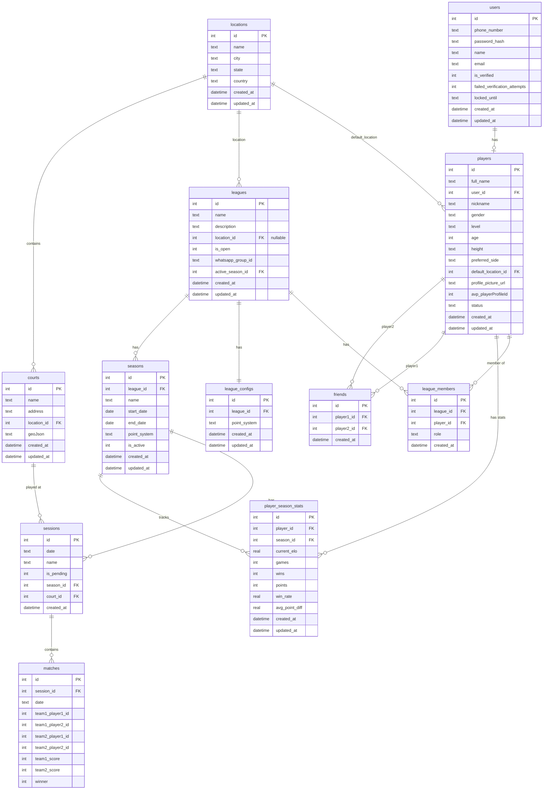

# Database Schema Documentation

## Entity Relationship Diagram

## Table Descriptions

### Core Tables

#### users
User accounts with phone-based authentication. Each user can claim one player profile.

#### players
Player profiles that can be seeded from AVP data. A player can be associated with one user (when claimed), but can exist without a user until claimed. Contains player information like name, gender, level, etc.

**Key Fields:**
- `full_name`: Player's full name (not unique, to allow duplicates)
- `user_id`: Foreign key to users table (nullable - allows unclaimed players)
- `avp_playerProfileId`: Identifier from AVP data for matching/updating
- `default_location_id`: Player's primary location

#### leagues
Leagues are groups of players who play together regularly. Each league has configuration settings and can have multiple seasons.

**Key Fields:**
- `is_open`: Whether the league is open to new players (1) or invite-only (0)
- `active_season_id`: Currently active season for the league
- `location_id`: Primary location of the league

#### league_configs
Configuration for each league (one-to-one relationship). Stores league-level settings such as point systems. ELO parameters (K-factor, initial ELO) are global constants applied to all ranked matches.

#### league_members
Join table linking players to leagues. Tracks membership and role (admin/member).

#### seasons
Seasons within a league. When a league is created, a season should also be created. Each season can have its own point system that overrides league config.

**Key Fields:**
- `start_date` / `end_date`: Season duration
- `is_active`: Whether the season is currently active
- `point_system`: JSON/text configuration that can override league defaults

#### player_season_stats
Season-specific player statistics. This replaces the denormalized stats in the old `players` table. Each row represents a player's stats for a specific season.

**Key Fields:**
- `current_elo`: Player's current ELO rating for this season
- `games`, `wins`, `points`: Game statistics
- Unique constraint on (player_id, season_id)

#### locations
Metropolitan areas based on player cities. Used to organize leagues, courts, and player default locations.

#### courts
Physical court locations where games are played. Each court belongs to a location and can have GeoJSON coordinates.

**Key Fields:**
- `geoJson`: GeoJSON format location data
- `location_id`: The metropolitan area this court belongs to

#### friends
Join table linking players as friends. Uses player1_id and player2_id where player1_id < player2_id to prevent duplicates.

#### sessions (updated)
Gaming sessions grouped by date/time. Now linked to seasons and courts.

**New Fields:**
- `season_id`: Foreign key to seasons (nullable for legacy sessions)
- `court_id`: Foreign key to courts (nullable)

### Existing Tables (unchanged)

#### matches
Match results between two teams. Stores player IDs, scores, date, and winner only. Player names can be resolved via `players`, and ELO deltas are tracked in `elo_history`.

#### partnership_stats
Statistics for how players perform with each partner.

#### opponent_stats
Statistics for how players perform against each opponent.

#### elo_history
Historical ELO changes over time for charting.

#### settings
Application configuration key-value store.

## Relationships Summary

1. **User ↔ Player**: One-to-one, optional (users can claim a player profile)
2. **League ↔ LeagueConfig**: One-to-one (each league has one config)
3. **League ↔ Player**: Many-to-many via `league_members`
4. **League → Season**: One-to-many (leagues have multiple seasons)
5. **League → Season**: One-to-zero-or-one (active_season_id)
6. **Season → Session**: One-to-many
7. **Season ↔ Player**: Many-to-many via `player_season_stats`
8. **Location → Court**: One-to-many
9. **Location → League**: One-to-many
10. **Location → Player**: One-to-many (via default_location_id)
11. **Court → Session**: One-to-many (optional)
12. **Player ↔ Player**: Many-to-many via `friends` (self-referential)

## Indexes

Indexes are created for:
- Foreign keys (for join performance)
- Unique constraints
- Frequently queried fields (dates, names, phone numbers)
- Composite indexes for common query patterns

## Migration Notes

- The existing `players` table data should be migrated to `player_season_stats` by creating a default season
- Legacy `sessions` will have NULL `season_id` and `court_id` values
- Players are seeded from `merged-player-ratings.json` using `avp_playerProfileId` as the stable identifier

