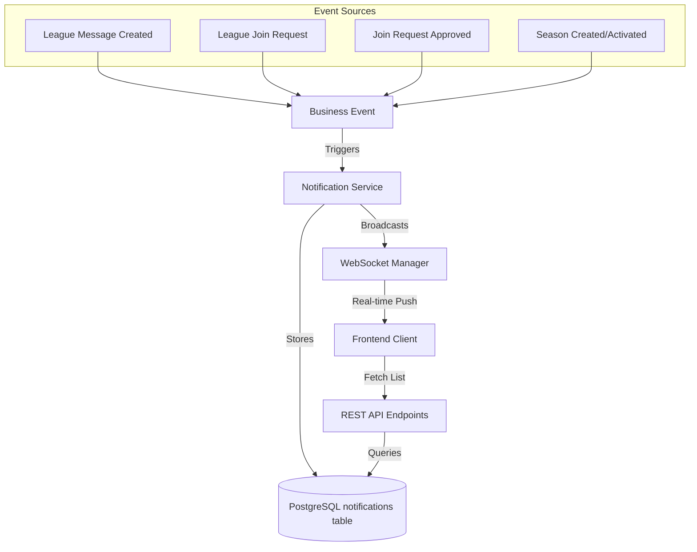
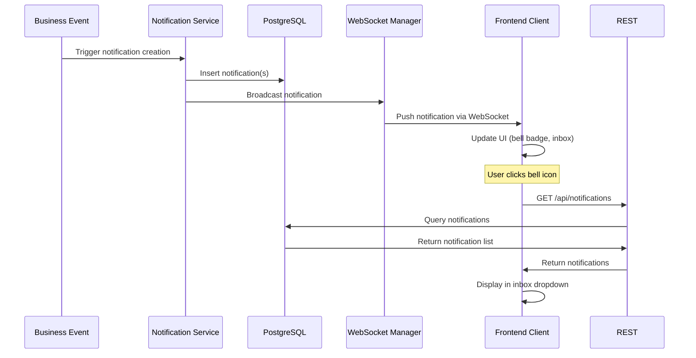
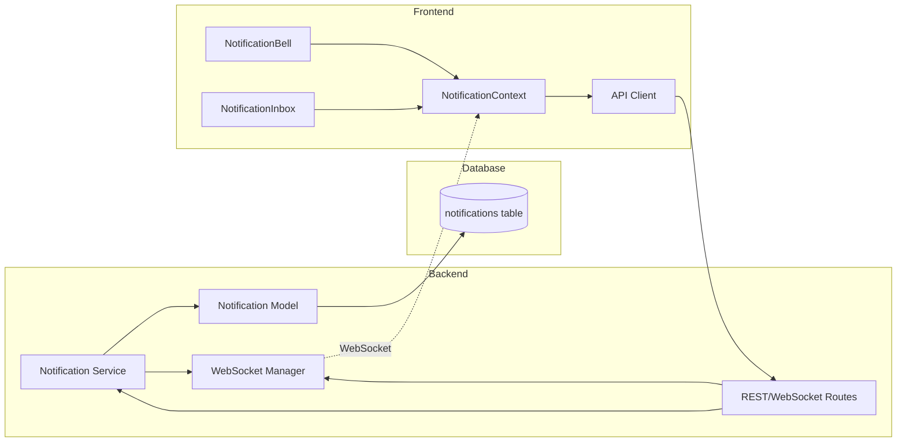
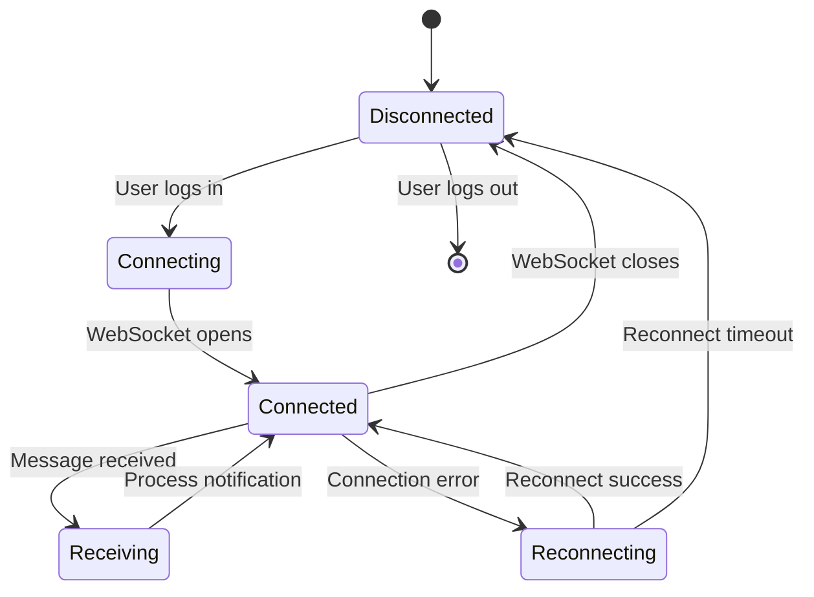
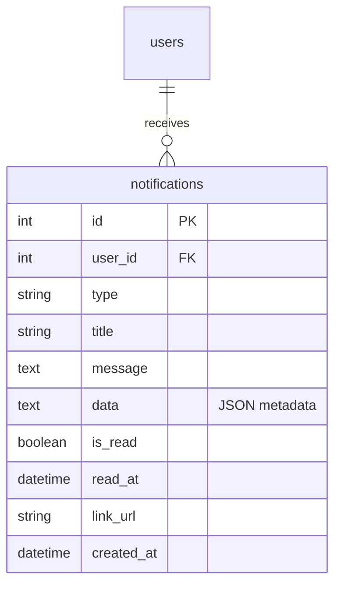
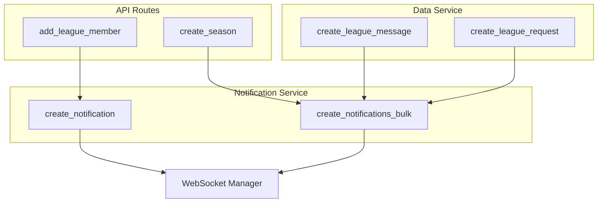
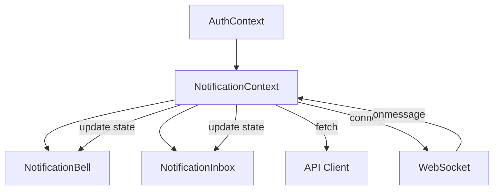
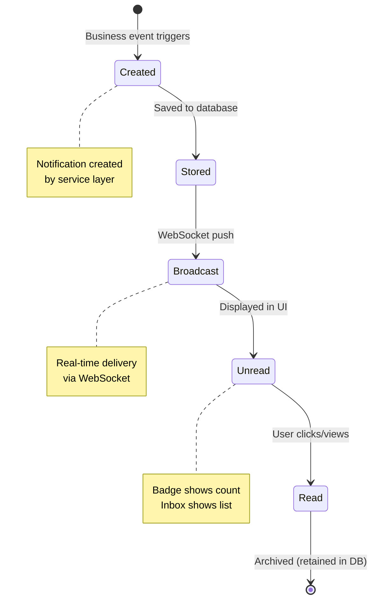

# Beach Kings Application Architecture

This document provides architecture diagrams and technical overviews for major systems in the Beach Kings application.

## Notification System Architecture

The notification system provides real-time in-app notifications for users, supporting events like league messages, join requests, and season starts.

### System Overview

### Data Flow

### Component Architecture

### Notification Types

The system supports the following notification types:

- **LEAGUE_MESSAGE**: Sent to all league members when a new message is posted
- **LEAGUE_JOIN_REQUEST**: Sent to league admins when someone requests to join
- **LEAGUE_INVITE**: Sent to a player when their join request is approved
- **SEASON_START**: Sent to all league members when a season becomes active
- **SEASON_ACTIVATED**: Reserved for future use when seasons are manually activated

### WebSocket Connection Management

### Database Schema

### Integration Points

### Frontend State Management

### Notification Lifecycle

## Technical Details

### Backend Components

- **Notification Model** (`apps/backend/database/models.py`): SQLAlchemy model for notifications table
- **Notification Service** (`apps/backend/services/notification_service.py`): Core business logic for notification operations
- **WebSocket Manager** (`apps/backend/services/websocket_manager.py`): Manages active WebSocket connections per user
- **REST Routes** (`apps/backend/api/routes.py`): HTTP endpoints for notification CRUD operations
- **WebSocket Route** (`apps/backend/api/routes.py`): WebSocket endpoint for real-time delivery

### Frontend Components

- **NotificationContext** (`apps/web/src/contexts/NotificationContext.jsx`): React context for notification state management
- **NotificationBell** (`apps/web/src/components/notifications/NotificationBell.jsx`): Bell icon component with unread badge
- **NotificationInbox** (`apps/web/src/components/notifications/NotificationInbox.jsx`): Dropdown inbox component
- **API Client** (`apps/web/src/services/api.js`): Functions for REST API calls

### Key Features

- **Real-time Delivery**: WebSocket connections provide instant notification delivery
- **Persistent Storage**: All notifications are stored in PostgreSQL for history
- **Pagination Support**: Efficient querying with limit/offset for large notification lists
- **Read/Unread Tracking**: Per-notification read status with timestamps
- **Bulk Operations**: Efficient bulk notification creation for league-wide events
- **Auto-reconnection**: WebSocket automatically reconnects on connection loss
- **Error Resilience**: Notification failures don't break main business operations

