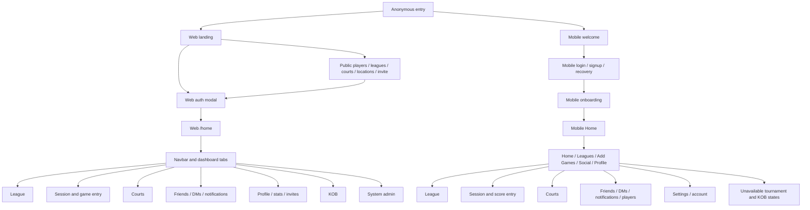

# Beach Kings E2E application flow map

Snapshot: 2026-08-11

This is the source-of-truth map for whole-application E2E coverage. It maps
user-reachable navigation, local interactions, mutations, and the important
success and failure branches across the web and mobile apps.

The map is derived from the checked-in Next.js routes, Expo Router registry,
interactive screen components, interaction-policy contract, and current test
suites. It describes the product that exists in this snapshot. Future
wireframes and roadmap-only features are out of scope until they become
reachable in a production client.

## How to read the map

Coverage labels:

| Label | Meaning |
| --- | --- |
| `W-E2E` | Driven through the web UI by Playwright against the real test backend |
| `M-E2E` | Driven through an installed mobile build by Maestro |
| `C` | Unit/component/integration coverage exists, but this is not whole-client E2E |
| `GAP` | No current E2E journey proves the interaction |
| `N/A` | Static or deliberately unavailable; the rendered state still needs a smoke assertion |

“Every click” means every behaviorally distinct interactive surface. Repeated
instances such as each player row, court card, pagination page, or score key are
represented once, then exercised with boundary data where appropriate.

## Coverage baseline

| Client | Current executable coverage | What that proves | Main limitation |
| --- | ---: | --- | --- |
| Web | 54 Playwright spec files, 209 `test()` cases | Broad browser + backend flows, including auth, leagues, sessions, social, courts, admin, and responsive modals | Several global/error/role branches and KOB flows remain uncovered |
| Mobile | 4 Maestro flows | Password login, Social hub navigation, accepting a friend request, Add Games to pickup score entry | Nearly all mobile mutations and unhappy paths are only mocked in Jest |
| Mobile component layer | 56 route/screen test files plus component/hook/data tests | Rendering, handler wiring, cache behavior, and many local states | Does not validate native navigation, OS permissions, keyboard, deep links, persistence, or real backend integration |

The old estimate in `docs/E2E_TEST_PLAN.md` predates most of the current web
suite. Test inventory must be generated from source in CI rather than maintained
as a hand-entered total.

## Actors and state partitions

Every journey below must declare the actor and starting state. A single happy
path under one role is not complete coverage.

| Dimension | Required partitions |
| --- | --- |
| Identity | anonymous; verified/incomplete profile; normal member; league admin; sole league admin; system admin |
| Account enforcement | normal; limited/restricted; suspended/restricted entry screen; deletion scheduled |
| Relationship | self; stranger; outgoing friend request; incoming request; friend; blocked by viewer; blocked by other player |
| League | non-member/open; non-member/invite-only; request pending; member; admin; only admin; no active season |
| Session | absent; active; submitted; creator; participant; invited non-participant; has matches; no matches |
| Connectivity | online; initial-load failure; mutation failure; offline/reconnect; expired access token; refresh failure |
| Content | populated; empty; one item; enough items to scroll/paginate; deleted/not found; malformed deep-link identifier |
| Device | web desktop; web phone viewport; iOS; Android; light/dark; large text; reduced motion where behavior changes |

## Global navigation graph

Global invariants to assert on every applicable journey:

- Every web page, including anonymous, error, legal, invite, and admin access
  states, renders the Navbar.
- Auth guards preserve or intentionally replace the destination; expired
  sessions do not leave a blank screen or private cached data.
- Mobile stack screens have a working temporal Back action and a correct Up
  fallback when cold-started from a deep link.
- A loading state resolves to populated, empty, unavailable, not-found, or
  actionable error UI; never an endless spinner.
- Double taps/submits do not duplicate mutations. Pending actions are disabled
  or idempotent.
- Success survives a reload/relaunch/refetch when persistence is expected.
- Failure leaves prior data intact, restores optimistic UI correctly, and
  offers retry where retry is useful.

## Web click network

### Global Navbar and overlays

Available from every web page unless the page is broken. These paths should be
tested once as a full matrix and smoke-checked on every route.

| Surface / click | Destination or state change | Happy path | Not-happy / boundary path | Coverage |
| --- | --- | --- | --- | --- |
| Home icon | `/` anonymous, `/home` authenticated | Correct landing and auth-aware destination | Auth initializes slowly; session expires during click | `W-E2E` partial |
| Find Courts | `/courts` | Directory loads | API error/empty, mobile viewport | `W-E2E` partial |
| Record Games | Create Game modal | Pickup or league game path selected | Zero leagues, one/many leagues, no active season, close/back | `W-E2E` |
| Leagues menu toggle | Dropdown | Opens, closes, outside-click/Escape closes | Empty league list | `W-E2E` partial |
| League row | `/league/:id` | Selected league opens | Deleted/forbidden league | `W-E2E` partial |
| Find Leagues | `/find-leagues` | Directory opens | API failure/empty | `W-E2E` partial |
| Create League | Modal -> `/league/:id?tab=details` | Valid submit creates league | Anonymous resumes after auth; invalid fields; request failure; duplicate submit | `W-E2E` partial |
| Notification bell | Inbox overlay | Badge, list, mark read, navigate | Empty, list failure, mark-read failure, outside-click/Escape | `W-E2E` partial |
| User menu | Dropdown | Profile, feedback, logout | Outside-click/Escape, logout API failure still clears local session | `W-E2E` partial |
| Log in / Sign up | Auth modal | Correct initial mode | Close returns to origin; pending destination retained | `W-E2E` partial |
| Feedback | Feedback modal | Valid category/text submit | Empty/too long, request failure, retry, close with draft | `C`, `GAP` E2E |
| Global confirmation | Confirmation modal | Confirm invokes one mutation | Cancel/overlay/Escape, submitting state, mutation error | `W-E2E` partial |
| Share fallback | Native share or fallback modal | Link copied/shared | Clipboard/share unavailable; cancel | `W-E2E` partial |
| Image lightbox | Overlay | Open, next/previous, close | One image, failed image, keyboard/touch navigation | `GAP` |

### Anonymous web routes

| Route / surface | Potential clicks and transitions | Happy paths | Required not-happy paths | Coverage |
| --- | --- | --- | --- | --- |
| `/` | Video controls; Log In; Sign Up; all Navbar actions | Authenticated visitor redirects to `/home`; auth completes | Invalid credentials/code, existing user, modal close, auth API unavailable | `W-E2E` auth |
| Auth modal | Google sign-in; password login/signup; switch sign-in/signup; forgot password; phone verification; resend code | Each supported auth method reaches intended destination | Invalid phone/password/code, expired code, resend cooldown, provider cancel/failure, duplicate account, rate limit | Password/signup/recovery `W-E2E`; Google/SMS `GAP` |
| `/courts` | Search; location/filter; list/map; court card/pin; add court; Navbar | Results filter; card/pin opens detail; authenticated submission succeeds | Geolocation deny/unavailable, zero results, map load error, anonymous Add Court auth gate, invalid submission, API error | Core `W-E2E`; map/geolocation `GAP` |
| `/courts/:slug` | Breadcrumb; location hub; website; photo gallery; nearby court; league; save/home-court; write/edit/delete review; suggest edit | Data renders and each child destination opens; review lifecycle | Invalid slug, missing coordinates/photos/reviews/website, anonymous mutation auth gate, duplicate review, failed save/delete/upload | Review/render `W-E2E`; remaining partial |
| `/courts/:slug/photos` | Back; thumbnail/lightbox; next/previous | Gallery navigation | Invalid court, no photos, image failure | `W-E2E` admin photo path only; public gallery `GAP` |
| `/find-leagues` | Search/filter; card; join/request; create league; auth links; friend avatar | Open/member/pending button states and navigation | Anonymous gate, invite-only, full/closed league, duplicate request, mutation failure, empty/error/pagination | Render/join `W-E2E` partial |
| `/find-players` | Search/filter; player card; friend action; auth links | Results and profile navigation | Empty/error/pagination, blocked/restricted players excluded, request race | Render `W-E2E`; filters/policy `GAP` |
| `/player/:id` | Redirect to canonical player URL | Correct slug generated | Invalid ID | `W-E2E` |
| `/player/:id/:slug` | Back; location; leagues; matches; awards; add/accept/remove friend; message; login/signup | Public stats and relationship-specific actions | Wrong slug canonicalization, self, not found, private/empty stats, action failure, both block directions, restriction, message unavailable | Main states `W-E2E`; policy/error branches `GAP` |
| `/league/:id` anonymous | Tabs: rankings, matches, awards, details, signups, messages; player/session links; sign in/up | Public data visible and tabs deep-link | Invalid ID, private content, no season/data, invalid tab falls back, API failure; protected tabs/actions gated | Render/invalid `W-E2E`; branches partial |
| `/beach-volleyball` | Location cards | Directory -> location | Empty/error | `W-E2E` |
| `/beach-volleyball/:slug` | Directory back; courts; leagues; players | Cross-page graph works | Invalid slug, empty sections, API failure | `W-E2E` happy/404 |
| `/invite/:token` | Sign up/login; claim; dismiss/back/home | Anonymous authenticates then claims; authenticated direct claim | Invalid, expired, already claimed, self/merge conflict, claim failure, retry | `W-E2E` |
| `/session/:code` | Back; join/auto-join; court; share; participant/player; view modes | Valid public/shared session opens | Invalid code, unauthenticated gate where applicable, closed/deleted session, join failure | Happy partial `W-E2E`; invalid/error `GAP` |
| `/kob/:code` | Now Playing/Schedule/Standings; score entry when authorized | Spectator live view and director scoring | Invalid code, stale concurrent score, unauthorized director action, offline/retry | `GAP` |
| `/privacy-policy`, `/terms-of-service`, `/community-guidelines`, `/support`, `/contribute` | Navbar; support mail link; repository/external links; cross-policy link | Correct content and safe external target | Link-handler unavailable, Navbar missing, external link attributes | Most `W-E2E`; community guidelines/external behaviors `GAP` |
| Unknown route / `not-found` | Return Home | Navbar and recovery link render | Anonymous/authenticated destinations correct | `GAP` |

### Authenticated web dashboard

All dashboard tabs are deep-linkable as `/home?tab=...`; an invalid tab must
fall back to Home. On phone widths, My Stats, Friends, Notifications, discovery,
and Pending Invites are reached through More; Messages remains directly visible.

| Tab / surface | Potential clicks and transitions | Happy paths | Required not-happy paths | Coverage |
| --- | --- | --- | --- | --- |
| Home | Stat card -> My Stats; league -> league; recent match -> session/league; open session -> session; nearby court -> court; create/join actions | Each card reaches correct entity | Empty widgets, partial widget failure, stale/deleted entity, location denied | Navigation partial `W-E2E` |
| Profile | Edit fields; avatar upload/crop/remove; add/remove/reorder primary home courts; save/cancel | Values persist after reload | Invalid values/image, oversized/corrupt image, API failure, unsaved-change navigation confirm | `W-E2E` strong; failures `GAP` |
| My Leagues | League row; create; find | Open and empty-state CTAs work | Load failure, deleted league | `W-E2E` partial |
| My Games | Filter/search; recent row; share placeholder invite; expand list; create game | Match/session navigation and share | Empty/error, deleted match, share unavailable, placeholder URL load failure | Core `W-E2E` partial |
| My Stats | Time range; chart; partnership/opponent rows | Stats update for selected range | Empty stats, failed load, single point, long names | `W-E2E` |
| Messages | Search; conversation; send; player profile; report/block/unblock | Thread sends, reads, clears unread state | Empty/error/retry, send failure, duplicate/rapid send, block both directions, restriction, websocket disconnect/reconnect | Notifications/navigation `W-E2E`; send/policy `GAP` |
| Friends | Search; friend profile; accept/decline/cancel; unfriend; add suggestion; find players | Relationship state updates | Per-section load failure, mutation rollback, crossed requests, both block directions, restricted actor | Main lifecycle `W-E2E`; resilience `GAP` |
| Pending Invites | Copy/share claim link; delete placeholder; empty CTA | Placeholder lifecycle works | Link failure, already claimed elsewhere, delete failure, placeholder used by match | `W-E2E` |
| Notifications | Filter/list; item; inline accept/decline; mark read/all read | Correct destination and unread counts | Empty/error, mutation failure, stale/deleted target, dedupe, realtime arrival while open | Core `W-E2E`; resilience `GAP` |
| More menu | Open; each hidden destination; outside click | All phone-only paths usable | Small viewport/keyboard/scroll; focus returns to trigger | Navigation `W-E2E` partial |

Dashboard-level unhappy paths:

- `/home` while signed out redirects to `/`; an expired session renders the
  explicit sign-in recovery state.
- An incomplete player gets the completion modal; valid submit dismisses and
  persists it. Invalid submit and API failure keep entered data.
- Switching tabs with dirty Profile changes invokes the unsaved-changes guard.
- Logout clears tokens and private UI even when the logout request fails.

### Authenticated league web app

| Surface | Potential clicks / mutations | Happy path | Not-happy / permission path | Coverage |
| --- | --- | --- | --- | --- |
| Header/menu | Back; switch league; rename league; choose tab/season | URL and selected data stay synchronized | Bad tab/season; rename empty/conflict/failure; non-admin cannot rename | Partial `W-E2E` |
| Rankings | Season selector; player row/details; navigate to games | Correct season/player data | Empty, ties, long lists, load failure | `W-E2E` |
| Games | Cards/clipboard toggle; session expand; player; add player; create/edit/delete match; edit/save/cancel session; change season/court; end/delete session; upload score photo; resolve unmatched player/placeholder | Full game/session lifecycle persists and refreshes stats | Invalid score/duplicate players; dirty cancel; participant removal with matches; upload/parse failure; unresolved player; stale job; concurrent edit; unauthorized user; mutation rollback | `W-E2E` strong, concurrency/permissions gaps |
| Awards | Season selector; player link; finalize where exposed | Awards appear after season end | Active season/no awards, finalization failure/unauthorized | Display `W-E2E`; action gaps |
| Details | Description; members modal; player; add/remove member; change role; create/edit season; join requests approve/decline/revisit; leave | Admin/member lifecycle | Sole admin cannot leave; self removal; duplicate member; invalid dates; last-admin demotion; request race/failure; non-admin controls absent | Core `W-E2E`; boundary gaps |
| Sign Ups | Create/edit/delete event; sign up/drop out; expand players; create/edit/delete weekly schedule | All changes persist | No selected/active season; full/closed event; duplicate signup; delete cancel; invalid dates; non-member/admin permissions; mutation failure | `W-E2E` strong; boundaries partial |
| Messages | Refresh; compose/send | Chronological post appears | Empty message, send/load failure, restricted/blocked participant, retry | Happy `W-E2E`; policy/errors `GAP` |
| Join prompt | Join open league; request invite-only | Membership/pending state updates | Anonymous auth gate; full/closed/already member; duplicate request; generic interaction-policy 409 | Main `W-E2E`; policy gaps |

### Pickup session web app

| Surface | Potential clicks / mutations | Happy path | Not-happy / boundary path | Coverage |
| --- | --- | --- | --- | --- |
| Session header | Rename; save/cancel; court; share/copy; leave; delete; back | Creator/member sees correct actions | Non-creator actions absent; invalid name; share unavailable; leave/delete cancel/failure | Core `W-E2E` partial |
| Players drawer | Open; search; add/remove; create placeholder; share invite; player details; Done | Roster updates at phone and desktop sizes | Full roster, duplicate, removal blocked by matches, load/mutation failure, keyboard/scroll | `W-E2E` strong |
| Games | Card/clipboard toggle; add/edit/delete match; player link | Valid games persist | Invalid score/team duplication, placeholder makes unranked, dirty cancel, mutation failure | `W-E2E` strong |
| Lifecycle | Submit/end; edit submitted; duplicate with same players; create new; return to My Games | State and stats persist | Submit with no/invalid games, server failure, double submit, deleted session | `W-E2E` partial |
| Invite link | Auto-join | Participant added once | Creator/self, already joined, full/closed/deleted, invalid code, join failure | Happy `W-E2E`; boundaries `GAP` |

### KOB web app

| Route | Click network | Happy paths | Not-happy paths | Coverage |
| --- | --- | --- | --- | --- |
| `/kob/create` | Format pills/recommendation; player add/remove/order; settings; preview; create | Tournament created and share code opens | Invalid count/name/settings, unauthenticated, create failure | `GAP` |
| `/kob/manage/:id` | Edit tournament; add/remove/reorder players; generate/start; director controls; delete | Director can manage lifecycle | Unauthorized, already started, invalid roster, stale concurrent update, delete cancel/failure | `GAP` |
| `/kob/:code` | Now Playing/Schedule/Standings; select match; enter/edit score | Public state updates and standings recalculate | Invalid code, invalid score, completed tournament, realtime disconnect | `GAP` |

### System admin web app

| Tab / surface | Potential clicks / mutations | Happy path | Required not-happy paths | Coverage |
| --- | --- | --- | --- | --- |
| Access gate | Sign in; Return home | System admin enters | Anonymous prompted; non-admin denied; revoked role on open session | Basic `W-E2E` |
| Dashboard | Refresh stats; include/exclude unregistered | Counts and recent players update | Partial/load failure, empty | `W-E2E` partial |
| Courts | Pending/all/suggestions; filters; clear; sort; paginate; expand row; approve/reject; apply selected suggestion fields; photo add/reorder/delete; review delete | Moderation changes public directory | No results; load failure/retry; mutation failure; cancel; invalid photo; concurrent moderation; selected-field validation | Broad `W-E2E`; failures partial |
| Moderation | Overview filters; case; evidence; action; retry job | Case state changes and audit history appears | Invalid action/reason, evidence unavailable, stale case, unauthorized/revoked admin, retry failure | `GAP` |
| Users | Search; status/role filters; paginate; expand history; grant/revoke system admin with reason | Role change reflected | Empty reason, self/last-admin safety, target changed concurrently, request failure | `GAP` |
| Feedback | Refresh; mark resolved/unresolved | State toggles | Empty/load/mutation failure | Component only, `GAP` E2E |
| Settings / WhatsApp | Edit config; initialize/logout; QR/status/groups/send where exposed | Valid config and state transition | Secret redaction, invalid destination/config, disconnected service, send failure | `GAP`; never expose credentials in artifacts |

## Mobile click network

The canonical routes are in `apps/mobile/src/lib/navigation.ts`. Each pushed
stack route must be tested both through its normal parent click and as a cold
deep-link entry to validate its Up fallback.

### Auth and account gate

| Route / surface | Potential clicks and transitions | Happy paths | Required not-happy paths | Coverage |
| --- | --- | --- | --- | --- |
| Welcome | Create Account; Sign In | Correct auth screen opens | Repeated tap; cold relaunch retains correct auth state | `M-E2E` sign-in only |
| Login | Email/password submit; forgot password; Sign Up; Google; Apple | Each configured provider reaches Home/onboarding | Invalid credentials, provider cancel/not configured, network/rate limit, keyboard submit, duplicate tap | Password happy `M-E2E`; rest `GAP` |
| Signup | Fields; password reveal; terms/privacy links; verification; login; Google/Apple | Account -> Verify -> Onboarding | Invalid/missing fields, duplicate account, provider failure, offline, legal links unavailable | `C`, `GAP` E2E |
| Verify | OTP cells; resend; back | Valid code advances | Invalid/expired code, resend cooldown/rate limit/failure | `C`, `GAP` E2E |
| Forgot password | Email/phone mode; request; OTP; resend; new password; back/login | Password reset logs in or returns to login as designed | Invalid identifier/code/password, expired token, resend and request failure | `C`, `GAP` E2E |
| Onboarding | Gender/level/location fields; skip where allowed; submit | Complete profile -> Home and persists | Missing/invalid, locations load failure, save failure, keyboard/scroll | `C`, `GAP` E2E |
| Restricted | Review decision; appeal; schedule deletion; logout | Allowed recovery action works | Invalid appeal, submit/deletion failure, prohibited app destinations remain blocked | `C`, `GAP` E2E |

### Root tabs and Home

| Surface | Potential clicks and transitions | Happy path | Not-happy / boundary path | Coverage |
| --- | --- | --- | --- | --- |
| Tab bar | Home; Leagues; Add Games; Social; Profile; re-tap active tab | Switches without stacking; re-tap scrolls to top; Social badge updates | Android Back returns to Home then exits; keyboard hides bar; large badge | Social/Add Games `M-E2E` partial |
| Home header | Messages; Notifications; avatar/Profile | Correct tab/route opens | Badge races, missing avatar | `C`, `GAP` E2E |
| Lead action | Continue session; Friends; finish onboarding; Add Games depending state | State-specific CTA reaches target | Stale/deleted session, load error, incomplete profile | `C`, `GAP` E2E |
| Recent games | Row -> session; See All -> My Games; horizontal scroll | Correct session opens | Empty/load error/deleted session | `C`, `GAP` E2E |
| Leagues rail | League card; Find Leagues | Correct route | Empty/error/deleted league | `C`, `GAP` E2E |
| Courts rail | Court card; See All | Correct route | Empty/error/deleted court/location unavailable | `C`, `GAP` E2E |
| Pull to refresh | Refresh Home queries | All visible data reconciles | One query fails; offline; stale private cache after account switch | `C`, `GAP` E2E |

### Leagues mobile

| Route / surface | Potential clicks / mutations | Happy path | Not-happy / permission path | Coverage |
| --- | --- | --- | --- | --- |
| Leagues tab | Find; Create; Received Invites; league row; refresh | Destinations open | Empty/error/retry, stale invite badge | `C`, `GAP` E2E |
| Find Leagues | Search/filter; card; join/request; create | Join open/request private | Empty/error, duplicate/full/closed, generic interaction 409, rollback | `C`, `GAP` E2E |
| Create League | Fields; location/court selectors; submit; back | League created -> detail | Permission/location denial, invalid form, duplicate tap, API failure | `C`, `GAP` E2E |
| League detail | Back; Games/Standings/Chat/Signups/Info tabs; join/request; add games; player/session links | Tabs deep-link and correct role UI | Not found/load error; bad tab; no season/data; mutation failure | `C`, `GAP` E2E |
| Games tab | Season; session; player; add game | Correct child route | Empty/error/stale session | `C`, `GAP` E2E |
| Standings | Season; player row/stat detail | Correct rankings | Empty/ties/load failure | `C`, `GAP` E2E |
| Chat | Refresh/scroll; compose/send; report | Message appears and realtime reconciles | Empty/send/load failure, restricted/block policy, reconnect | `C`, `GAP` E2E |
| Signups | Event row; sign up/drop out | Roster/capacity update | Full/closed/duplicate, mutation failure/rollback | `C`, `GAP` E2E |
| Info | Player; admin role toggle; remove; seasons add/edit; invite; leave | Role-appropriate lifecycle | Sole admin leave, self/last-admin change, invalid season, mutation failure | `C`, `GAP` E2E |
| Invite players | Search/select; send; share placeholder if shown | Selected eligible players invited | Empty selection, blocked/restricted/ineligible, partial batch failure, duplicate tap | `C`, `GAP` E2E |
| Received/Pending invites | Accept/decline; invitation row; placeholder claim links | Correct league/claim state | Expired/already handled, mutation failure, empty/error | `C`, `GAP` E2E |

### Sessions and score entry mobile

| Route / surface | Potential clicks / mutations | Happy path | Not-happy / boundary path | Coverage |
| --- | --- | --- | --- | --- |
| Add Games | League Game; Pickup Game; league selection; continue active session; start new; Find League; back | Pickup reaches scoreboard; league context passed correctly | Zero leagues, load failure/retry, existing active session choice, no active season | Pickup entry `M-E2E`; rest `GAP` |
| Create Session | League/season/court/date/name/ranked; preselected players; submit | Session -> detail | Invalid params/form, location unavailable, no season, submit failure/double tap | `C`, `GAP` E2E |
| Session detail | Menu; player; add/invite; court picker; add game; submit confirm; error dismiss | Roster/game/session updates | Not found/load error, non-owner permissions, full roster, submit invalid/failure | `C`, `GAP` E2E |
| Session menu | Edit details; manage roster; share; duplicate; results; leave/delete | Implemented actions work and return correctly | Cancel, share failure, unsupported actions show honest unavailable state, mutation failure | `C`, `GAP` E2E |
| Edit details | Fields; save; cancel/back | Changes persist | Dirty discard; invalid; failure | `C`, `GAP` E2E |
| Manage roster | Search; add/remove; player; Done | Roster persists | Duplicate/full, player has matches, policy denial, failure | `C`, `GAP` E2E |
| Invite players | Search/filter/select; invite batch | Eligible players invited once | Empty, no results, partial denial, batch failure, retry | `C`, `GAP` E2E |
| Score Game | Roster seat selectors; add new player; team active selector; keypad; swap; game number/context; save/submit; edit/delete; menu/back | Valid score persists -> session | Same player twice, missing four players, tie/impossible score, unsaved back, add-player cancel, save/delete failure, duplicate submit, offline/reconnect | Screen opens `M-E2E`; mutation paths `GAP` |
| Add New Player | Existing search; placeholder fields; submit; back | Player returned into correct roster slot | Duplicate/invalid, create failure, context lost after reload | `C`, `GAP` E2E |
| My Games | Filter/row/refresh | Session opens | Empty/error/deleted | `C`, `GAP` E2E |
| My Stats | Range/filter, charts/rows | Data updates | Empty/error/sparse data | `C`, `GAP` E2E |

### Social mobile

| Route / surface | Potential clicks / mutations | Happy path | Not-happy / policy path | Coverage |
| --- | --- | --- | --- | --- |
| Social subnav | Messages; Notifications; Friends; Find Players | All four switch in-place and deep-link | Invalid tab falls back; state survives tab switch; unread badge | Navigation `M-E2E` |
| Messages list | Search/clear; conversation; compose empty CTA; refresh | Thread opens | Empty/error/retry, filtered blocked users, stale unread | `C`, `GAP` E2E |
| Message thread | Back; player header; send; retry; report message/player; block/unblock | Send/read/realtime/unread lifecycle | Offline/send retry, duplicate, refresh race, both block directions, restriction, deleted user | `C`, `GAP` E2E |
| Notifications | Category chips; item; inline friend accept/decline; mark all; refresh | Destination and unread counts update | Empty/error/retry, stale target, mutation failure, dedupe, push while open | `C`, `GAP` E2E |
| Friends | Search; request accept/decline; friend/suggestion; Add Friend; Find Players empty CTA; refresh | Accept is the only mutation currently `M-E2E` | Per-section error, rollback, crossed requests, block/restriction filtering | Accept `M-E2E`; rest `GAP` |
| Find Players | Search/clear; filters/chips; player; add friend; paginate/refresh | Profile/request state updates | Empty/no matches/error, request race, blocked/restricted excluded | `C`, `GAP` E2E |
| Player profile | Back; message; add/accept/decline/remove friend; league; More -> report/block/unblock/invite | Relationship-specific actions update | Self/not found/load error, generic unavailable policy, mutation rollback, blocked history | `C`, `GAP` E2E |
| Native push | Permission prompt; notification tap from foreground/background/terminated; badge | Opens canonical target exactly once | Denied permission, malformed/stale payload, signed out, restricted target, duplicate delivery | `C`, `GAP` E2E |

### Courts mobile

| Route / surface | Potential clicks / mutations | Happy path | Not-happy / OS path | Coverage |
| --- | --- | --- | --- | --- |
| Courts | List/map toggle; search/filter; row/pin; location; refresh | Result opens detail; map clusters | Location allow/deny/limited, no coordinates/results, map/list load failure | `C`, `GAP` E2E |
| Court detail | Back; hero/photo; map/external directions; website; check in; save/unsave home court; review write/edit/delete; suggest edit; leagues/players; report | Each action updates and survives refetch | Missing photos/map/site, OS link failure, already checked in/reviewed, permission/auth/policy denial, mutation failure | `C`, `GAP` E2E |
| Photos | Carousel/lightbox; upload; report | Upload appears | Camera/library permission deny, cancel, bad/large image, upload failure, zero photos | `C`, `GAP` E2E |
| Suggest Edit | Fields; map pin; reset; submit | Pending suggestion acknowledged | No change, invalid pin/ID, submit failure | `C`, `GAP` E2E |

### Profile and settings mobile

| Route / surface | Potential clicks / mutations | Happy path | Not-happy / destructive path | Coverage |
| --- | --- | --- | --- | --- |
| Profile | Avatar; edit field sheets; Settings; My Stats; My Games; Friends; trophies/leagues | Edits/avatar persist | Dirty discard, invalid field/image, mutation failure | `C`, `GAP` E2E |
| Settings hub | Change password; phone; connected Google/Apple; privacy; blocked users; account status; notifications; appearance; feedback; support; rate app; legal links; logout; delete | Each child/OS link opens | Provider unavailable/cancel, OS link failure, logout failure, restricted states | `C`, `GAP` E2E |
| Change password | Fields; reveal; submit | New password works after relogin | Wrong current/weak mismatch, network/rate limit | `C`, `GAP` E2E |
| Add phone | Phone; request OTP; verify; resend | Phone persists | Invalid/duplicate phone/code, cooldown, API failure | `C`, `GAP` E2E |
| Privacy | Toggle discoverability/contact settings | Persist after relaunch | Mutation failure rolls back | `C`, `GAP` E2E |
| Blocked users | Row/profile; unblock | User disappears and interactions return after refetch | Empty/error, mutation failure, history visibility policy | `C`, `GAP` E2E |
| Account status | Appeal; schedule/cancel deletion where exposed | Correct status/action | Invalid appeal, failure, restricted navigation | `C`, `GAP` E2E |
| Notifications settings | Master/category switches; OS settings | Backend and OS state agree | Permission denied/provisional, save rollback, offline | `C`, `GAP` E2E |
| Appearance | System/light/dark | Applies immediately and persists | Relaunch/system theme change; contrast smoke | `C`, `GAP` E2E |
| Feedback/support | Form submit; email/support links | Submission/link succeeds | Validation, offline, OS mail unavailable | `C`, `GAP` E2E |
| Delete account | Schedule deletion or immediate delete confirmation; cancel; logout | Correct account state and private cache cleared | Cancel at each step, API failure, repeated request; never test against remote/shared data | `C`, `GAP` E2E |

### Mobile deep links and deliberately unavailable routes

| Route | Expected behavior | Required E2E branches | Coverage |
| --- | --- | --- | --- |
| Invite `/invite/:token` | Claim after auth or show token state | Valid anonymous/authenticated; invalid; already claimed; dismiss; cold-start Back/Up | `C`, `GAP` E2E |
| `/messages/:playerId`, notification targets, player/league/session/court links | Auth guard then canonical screen | Foreground/background/terminated; malformed/deleted target; no history Up | `C`, `GAP` E2E |
| Tournament list/detail/create | Honest unavailable screen | Direct link and parent click render unavailable, Back/Up works, no fake success mutation | `C`, `GAP` E2E |
| KOB code | Honest “coming soon” screen | Valid/invalid code behave consistently; Back/Up works | `C`, `GAP` E2E |
| Legacy redirect routes | Redirect to Social/Profile canonical route | Query tab retained; no duplicate stack entry | `C`, `GAP` E2E |

## Cross-cutting unhappy-path suites

These are parameterized contracts, not one-off tests per screen.

### Network and server-state contract

For each representative query and every mutation family:

1. Initial request succeeds.
2. Initial request returns 401 and refresh succeeds.
3. Refresh fails: app signs out, private Query cache is cleared, and no previous
   user's data flashes after account switch.
4. Initial request returns 403/404/409/422/429/500 and produces the intended,
   non-sensitive message.
5. Request is offline/times out; retry succeeds.
6. Mutation fails after optimistic update; only that mutation rolls back.
7. A newer socket/refetch update arrives before the failure; rollback does not
   overwrite the newer data.
8. Rapid double submit creates at most one durable record.

### Interaction-policy contract

Drive every row in `docs/interaction-policy.md` through a real client and real
backend for both directions:

| Path | Blocker -> blocked | Blocked -> blocker | After unblock |
| --- | --- | --- | --- |
| Direct messages | Generic unavailable; no delivery/badge | Same | History returns; new send works |
| Friend requests/actions | Denied; relationship/request cleaned | Same | Old request not restored |
| League invites | Generic 409 surfaced safely | Same | New invite works |
| Session invites, including batch | Denied without partial bypass | Same | New invite works |
| Notifications/events | Hidden and no unread leak | Same | Only new events appear |
| Discovery/suggestions | Both excluded, counts correct | Same | Visible after refetch |
| Shared league facts | Still visible | Still visible | Still visible |
| Shared league chat | Blocked content/actions follow policy | Reverse-direction rule follows policy | Normal state returns |

Also run the same mutation families while the actor is account-restricted. UI
preflight improves clarity, but the E2E assertion must prove backend denial too.

### Navigation and presentation contract

- Browser reload and mobile process kill/relaunch on every durable success.
- Browser Back/Forward across tab query parameters and entity pages.
- Mobile Back after normal push; Up after cold deep link; Android system Back on
  tab roots.
- Phone web viewport and both native platforms for bottom sheets, keyboards,
  long lists, and destructive confirmations.
- Empty, one-item, overflow, long-name, missing-image, and large-text fixtures.
- Modal/sheet focus or accessibility focus, Escape/back dismissal, screen-reader
  name/role/state, and minimum touch target smoke checks.
- Light/dark/system theme and reduced-motion checks where visual state or motion
  changes behavior.

## Executable journey backlog

Priority is based on user impact, mutation risk, and how much code a journey
traverses. P0 is required for a release gate; P1 should run nightly or on the
affected feature; P2 can run on a scheduled broad suite.

### P0: release gate

| ID | Client | Journey | Required variants |
| --- | --- | --- | --- |
| E2E-AUTH-01 | Web + mobile | New account -> verify -> onboarding -> Home -> logout -> login | Invalid field/code/password; expired session; cache clear |
| E2E-GAME-01 | Web + mobile | Create pickup session -> roster -> score game -> submit -> stats -> edit | Invalid roster/score; save failure; dirty cancel; delete |
| E2E-GAME-02 | Web + mobile | League game -> active season/session -> score -> standings | Zero league/no season; permission denial; refresh persistence |
| E2E-LEAGUE-01 | Web + mobile | Create league -> season -> members -> role -> signup/schedule -> leave | Validation; sole-admin guard; mutation failures |
| E2E-SOCIAL-01 | Web + mobile | Discover -> request -> accept -> DM -> notification -> unfriend | Decline/cancel; send failure; unread/read lifecycle |
| E2E-POLICY-01 | Web + mobile | Block and restrict across DM/friend/invite/discovery/shared facts | Both directions and after unblock |
| E2E-COURT-01 | Web + mobile | Discover court -> save/check in -> review -> photo -> suggest edit | Permission deny, duplicate review, upload/mutation failures |
| E2E-CACHE-01 | Mobile | Account A data -> logout -> Account B login | No A data flash; canceled queries/socket; refresh failure |
| E2E-DEEP-01 | Mobile | Cold deep links for session/league/player/court/invite/notification | Signed out, malformed/deleted, Back/Up |
| E2E-ADMIN-01 | Web | Submit court/suggestion -> admin moderate -> public result | Reject/cancel/failure/concurrent action |

### P1: core regression

| ID | Client | Journey |
| --- | --- | --- |
| E2E-PROFILE-01 | Web + mobile | Edit profile, avatar, home courts, privacy, persistence |
| E2E-INVITE-01 | Web + mobile | Placeholder/share token -> claim/merge -> ranked recalculation |
| E2E-NOTIFY-01 | Web + mobile | Foreground/background notification routing and dedupe |
| E2E-RECOVERY-01 | Web + mobile | Forgot/reset password and phone verification branches |
| E2E-ACCOUNT-01 | Mobile | Connected account, notification prefs, appearance, feedback/support |
| E2E-ACCOUNT-02 | Mobile | Restricted account appeal and deletion scheduling/cancel |
| E2E-RESP-01 | Web | Global nav, tabs, drawers, forms at desktop and phone viewports |
| E2E-ADMIN-02 | Web | Moderation case, user role, feedback, config permission paths |
| E2E-KOB-01 | Web | Create/manage/live/score KOB tournament |

### P2: discovery, resilience, and static surface

| ID | Client | Journey |
| --- | --- | --- |
| E2E-GEO-01 | Web + mobile | Location -> court -> league -> player graph; location permission states |
| E2E-EMPTY-01 | Web + mobile | Every list with zero/one/overflow records and retry |
| E2E-EXTERNAL-01 | Web + mobile | Website, map, share, email, app-store, and legal links |
| E2E-ACCESS-01 | Web + mobile | Keyboard/screen-reader/large-text/reduced-motion smoke |
| E2E-UNAVAILABLE-01 | Mobile | Tournament/KOB unavailable routes and honest recovery navigation |
| E2E-STATIC-01 | Web | All public/legal/support/not-found pages include Navbar |

## Fixtures

Fixtures must be additive and restricted to local or ephemeral test databases.
Never delete, reset, recreate, or bulk-clean a remote database.

Required deterministic fixture families:

- Users: anonymous, incomplete, normal A/B/C, restricted, deletion-scheduled,
  system admin, provider-linked, avatar/no-avatar.
- Relationships: stranger, outgoing/incoming request, friends, A blocks B, B
  blocks A, mutual friend.
- Leagues: open, invite-only, full/closed, zero/multiple active seasons, normal
  member, admin, sole admin, pending/rejected join request.
- Sessions: pickup/league, active/submitted/deleted, creator/member/invitee, no
  games/valid games/placeholder games, court/no court.
- Courts: coordinates/no coordinates, photos/no photos, reviews/no reviews,
  saved/check-in state, pending submission/suggestion.
- Content volume: zero, one, page-size, page-size + 1, very long display names,
  missing optional media.
- Failpoints: controllable 401/403/404/409/422/429/500, timeout, dropped socket,
  delayed response, and mutation-after-socket race.

Each test run uses a unique namespace. Teardown should delete only records the
run created in an ephemeral database; additive retained fixtures are acceptable
when safe deletion cannot be guaranteed.

## Suite architecture

- Keep Playwright for web. Tag tests `@smoke`, `@p0`, `@p1`, `@p2`, `@admin`,
  `@policy`, and `@destructive-local`.
- Expand Maestro for black-box mobile journeys. Keep flows short and compose
  setup/login helpers instead of one giant YAML file.
- Seed through guarded backend fixture APIs/scripts, then perform the behavior
  under test through the UI. API setup is allowed; API execution of the action
  being tested does not count as UI E2E coverage.
- Add stable accessibility labels/test IDs only where visible text is not a
  durable selector.
- Capture screenshot, client logs, backend correlation ID, and network trace on
  failure. Redact tokens, OTPs, passwords, email/phone data, and private message
  bodies from artifacts.
- Shard by independent fixture namespace. Never let tests depend on execution
  order or another test's retained state.

Suggested gates:

| Trigger | Suite |
| --- | --- |
| Pull request | Web + mobile P0 smoke for touched domains; static route/Navbar contract |
| Merge to main | Full P0 on web, iOS, Android; policy contract |
| Nightly | P0 + P1, offline/reconnect, deep links, two viewports/platforms |
| Weekly | P2, accessibility/large text, concurrency, full admin and KOB |

## Definition of done

A mapped interaction is E2E-complete only when:

1. The normal parent click reaches it and a direct URL/deep link behaves
   correctly.
2. The happy mutation is performed through the UI and durable state is verified
   after reload/relaunch/refetch.
3. Validation, cancel, permission denial, not-found, empty, and server failure
   branches relevant to the interaction are asserted.
4. Role, relationship, block, and restriction variants are asserted where the
   action targets another person or protected league data.
5. Optimistic rollback, rapid double action, and realtime/refetch race are
   asserted for high-risk mutations.
6. Web phone layout or native keyboard/OS permission behavior is covered when
   the interaction can be obscured or redirected by the platform.
7. The test owns deterministic data, can run alone and in parallel, and leaves
   remote data untouched.
8. Test artifacts contain no secrets or PII.

## Route inventory checklist

This appendix is the route-level completeness check. A route may share its
behavioral journey with another row above, but it must still receive a direct
render, guard, Navbar/TopNav, not-found, and Back/Up smoke test as applicable.

### Web routes

| Route | Route role | Journey owner |
| --- | --- | --- |
| `/` | Anonymous landing and auth entry | `E2E-AUTH-01` |
| `/home?tab=home` | Authenticated dashboard | `E2E-RESP-01` |
| `/home?tab=profile` and `/profile` redirect | Profile editor | `E2E-PROFILE-01` |
| `/home?tab=leagues` | User leagues | `E2E-LEAGUE-01` |
| `/home?tab=my-games` | User games | `E2E-GAME-01` |
| `/home?tab=my-stats` | User stats | `E2E-GAME-01` |
| `/home?tab=friends` | Friends | `E2E-SOCIAL-01` |
| `/home?tab=messages` | Direct messages | `E2E-SOCIAL-01`, `E2E-POLICY-01` |
| `/home?tab=invites` | Placeholder/pending invites | `E2E-INVITE-01` |
| `/home?tab=notifications` | Notifications | `E2E-NOTIFY-01` |
| `/league/:id` | Public/member/admin league app | `E2E-LEAGUE-01`, `E2E-GAME-02` |
| `/session/:code` | Pickup/league session | `E2E-GAME-01`, `E2E-GAME-02` |
| `/find-leagues` | League discovery | `E2E-LEAGUE-01` |
| `/find-players` | Player discovery | `E2E-SOCIAL-01`, `E2E-POLICY-01` |
| `/player/:id` | Canonical-profile redirect | `E2E-GEO-01` |
| `/player/:id/:slug` | Public/player relationship profile | `E2E-SOCIAL-01`, `E2E-POLICY-01` |
| `/courts` | Court directory/map | `E2E-COURT-01` |
| `/courts/:slug` | Court detail | `E2E-COURT-01` |
| `/courts/:slug/photos` | Public court gallery | `E2E-COURT-01` |
| `/beach-volleyball` | Location directory | `E2E-GEO-01` |
| `/beach-volleyball/:slug` | Public location hub | `E2E-GEO-01` |
| `/invite/:token` | Placeholder claim deep link | `E2E-INVITE-01` |
| `/kob/create` | KOB creation | `E2E-KOB-01` |
| `/kob/manage/:id` | KOB director management | `E2E-KOB-01` |
| `/kob/:code` | KOB live/public | `E2E-KOB-01` |
| `/admin-view` | System administration | `E2E-ADMIN-01`, `E2E-ADMIN-02` |
| `/privacy-policy` | Legal | `E2E-STATIC-01` |
| `/terms-of-service` | Legal | `E2E-STATIC-01` |
| `/community-guidelines` | Safety/legal | `E2E-STATIC-01` |
| `/support` | Support | `E2E-STATIC-01`, `E2E-EXTERNAL-01` |
| `/contribute` | Repository contribution link | `E2E-STATIC-01`, `E2E-EXTERNAL-01` |
| Unknown URL | Not-found recovery | `E2E-STATIC-01` |

The web `/api/backend-url` and `/api/og/...` route handlers are service/metadata
endpoints, not clickable pages. Cover them with API/metadata integration tests
and verify their output indirectly in route smoke tests.

### Mobile routes

Route groups are shown explicitly because Expo Router deep links and Up
fallbacks depend on them.

| Route | Route role | Journey owner |
| --- | --- | --- |
| `/(auth)/welcome` | Anonymous entry | `E2E-AUTH-01` |
| `/(auth)/login` | Login | `E2E-AUTH-01` |
| `/(auth)/signup` | Account creation | `E2E-AUTH-01` |
| `/(auth)/verify` | OTP verification | `E2E-AUTH-01` |
| `/(auth)/forgot-password` | Account recovery | `E2E-RECOVERY-01` |
| `/(auth)/onboarding` | Profile completion | `E2E-AUTH-01` |
| `/(account)/restricted` | Account enforcement | `E2E-ACCOUNT-02` |
| `/(tabs)/home` | Home tab | `E2E-RESP-01` |
| `/(tabs)/leagues` | Leagues tab | `E2E-LEAGUE-01` |
| `/(tabs)/add-games` | Add Games tab | `E2E-GAME-01`, `E2E-GAME-02` |
| `/(tabs)/social?tab=...` | Social hub and four subnav states | `E2E-SOCIAL-01`, `E2E-NOTIFY-01` |
| `/(tabs)/profile` | Profile tab/editor | `E2E-PROFILE-01` |
| `/(stack)/find-leagues` | League discovery | `E2E-LEAGUE-01` |
| `/(stack)/create-league` | League creation | `E2E-LEAGUE-01` |
| `/(stack)/league/:id` | League detail | `E2E-LEAGUE-01`, `E2E-GAME-02` |
| `/(stack)/league/:id/invite` | League invitations | `E2E-LEAGUE-01`, `E2E-POLICY-01` |
| `/(stack)/received-invites` | Received league invites | `E2E-LEAGUE-01` |
| `/(stack)/pending-invites` | Pending placeholder invites | `E2E-INVITE-01` |
| `/(stack)/session/create` | Session creation | `E2E-GAME-01`, `E2E-GAME-02` |
| `/(stack)/session/:id` | Session detail | `E2E-GAME-01`, `E2E-DEEP-01` |
| `/(stack)/session/:id/edit` | Session metadata edit | `E2E-GAME-01` |
| `/(stack)/session/:id/roster` | Session roster management | `E2E-GAME-01` |
| `/(stack)/score-game` | Score entry/edit | `E2E-GAME-01`, `E2E-GAME-02` |
| `/(stack)/add-new-player` | Score-roster player creation | `E2E-GAME-01` |
| `/(stack)/invite-players` | Session invitation batch | `E2E-GAME-01`, `E2E-POLICY-01` |
| `/(stack)/my-games` | Personal game history | `E2E-GAME-01` |
| `/(stack)/my-stats` | Personal statistics | `E2E-GAME-01` |
| `/(stack)/courts` | Court directory/map | `E2E-COURT-01` |
| `/(stack)/court/:id` | Court detail | `E2E-COURT-01` |
| `/(stack)/court/:id/photos` | Court photo gallery/upload | `E2E-COURT-01` |
| `/(stack)/court/:id/suggest-edit` | Court edit suggestion | `E2E-COURT-01` |
| `/(stack)/player/:id` | Player profile/actions | `E2E-SOCIAL-01`, `E2E-POLICY-01` |
| `/(stack)/messages` | Legacy/canonical message-list redirect | `E2E-DEEP-01` |
| `/(stack)/messages/:playerId` | Direct-message thread | `E2E-SOCIAL-01`, `E2E-POLICY-01` |
| `/(stack)/notifications` | Legacy/canonical notification redirect | `E2E-DEEP-01` |
| `/(stack)/find-players` | Legacy/canonical discovery redirect | `E2E-DEEP-01` |
| `/(stack)/invite/:token` | Claim deep link | `E2E-INVITE-01`, `E2E-DEEP-01` |
| `/(stack)/settings` | Settings hub | `E2E-ACCOUNT-01` |
| `/(stack)/settings/change-password` | Password change | `E2E-ACCOUNT-01` |
| `/(stack)/settings/phone` | Add/verify phone | `E2E-RECOVERY-01` |
| `/(stack)/settings/privacy` | Privacy settings | `E2E-PROFILE-01` |
| `/(stack)/settings/blocked` | Blocked users | `E2E-POLICY-01` |
| `/(stack)/settings/account-status` | Moderation/account status | `E2E-ACCOUNT-02` |
| `/(stack)/settings/notifications` | Push preferences | `E2E-NOTIFY-01` |
| `/(stack)/settings/appearance` | Theme preference | `E2E-ACCOUNT-01` |
| `/(stack)/settings/feedback` | Feedback form | `E2E-ACCOUNT-01` |
| `/(stack)/settings/support` | Support links | `E2E-ACCOUNT-01`, `E2E-EXTERNAL-01` |
| `/(stack)/tournaments` | Deliberately unavailable list | `E2E-UNAVAILABLE-01` |
| `/(stack)/tournament/:id` | Deliberately unavailable detail | `E2E-UNAVAILABLE-01` |
| `/(stack)/tournament/create` | Deliberately unavailable creation | `E2E-UNAVAILABLE-01` |
| `/(stack)/kob/:code` | Deliberately unavailable KOB | `E2E-UNAVAILABLE-01` |

`apps/mobile/app/index.tsx` redirects to `/(tabs)/home`; `edit-profile.tsx`
redirects to the Profile tab. Both redirects need loop-free smoke tests.

## Maintenance rule

Any change that adds a route, tab, menu item, button, pressable row, form submit,
deep-link target, notification target, or backend mutation must update this map
and either:

- add/extend an E2E journey,
- explicitly mark the interaction `GAP` with a backlog ID, or
- mark it `N/A` with the reason it is deliberately unavailable or static.

CI should fail when a new Expo route is missing from the route table, a new web
`page.tsx` lacks a route smoke case, or a new cross-user action is absent from
the interaction-policy matrix.
