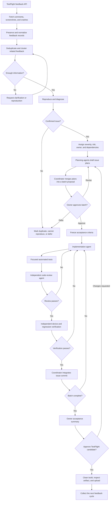
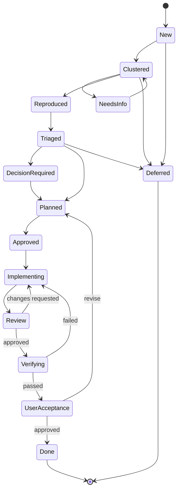

# TestFlight Feedback Triage Workflow

## Purpose

Turn TestFlight comments, screenshots, and crashes into reviewed Beach League
changes without losing product-owner control. Raw feedback and working plans
stay private and gitignored. Source changes remain traceable through focused
commits on one integration branch.

## Workflow graph



## Issue lifecycle



## Roles and handoffs

| Role | Responsibilities | Write access |
| --- | --- | --- |
| Coordinator | Own state, assign work, merge plans, enforce gates, summarize evidence | Integration branch and private workspace |
| Intake agent | Fetch feedback, preserve comments and screenshots, and find duplicates | Private intake artifacts only |
| Diagnosis agent | Reproduce symptoms, inspect code and tests, identify likely cause | Read-only |
| Planning agent | Draft scope, options, acceptance criteria, risks, and test strategy | Private plan only |
| Implementation agent | Make one approved change and its focused tests | One issue at a time |
| Review agent | Independently inspect requirements, diff, tests, and regressions | Review artifact only |
| Verification agent | Run tests and simulator or device checks against acceptance criteria | Evidence artifacts only |
| Product owner | Resolve product choices and approve batches and release candidates | Approval decisions |

The reviewer receives the original feedback, frozen acceptance criteria, diff,
and test results. Do not provide the implementer's self-review or predicted
findings.

## Approval gates

### Gate 1: triage and product decisions

Present clusters, severity, dependencies, duplicates, and explicit product
choices. Stop for decisions involving privacy defaults, safety policy,
navigation ownership, new product behavior, or scope expansion.

### Gate 2: batch plan

Present the proposed issue order, acceptance criteria, implementation surface,
test plan, and known risks. Do not change product code until the owner approves
the batch.

### Gate 3: release candidate

Present implemented commits, review results, automated checks, device evidence,
remaining risks, and deferred feedback. Build and upload only after approval.

Clear defects may proceed within an approved batch without another owner prompt.
Examples include a button that does nothing, stale uploaded media, keyboard-
obscured text, or the wrong player being labeled as the viewer.

## Branch and concurrency policy

Create one integration branch from current `main`:

```text
testflight/YYYY-MM-DD-batch-N
```

Planning, diagnosis, and review agents may run concurrently because their work
is read-only or confined to private artifacts. Only one implementation agent
writes to the integration branch at a time. Use one focused commit per issue:

```text
fix(mobile): refresh avatar after upload (TF-004)
```

For a large independent change, use a temporary worktree and issue branch,
review it there, and cherry-pick the approved commit onto the integration
branch. Never let parallel agents edit the same working tree.

## Private workspace

Keep generated feedback, screenshots, plans, reviews, and evidence out of Git:

```text
.testflight-triage/
├── state.json
├── raw/
├── screenshots/
├── issues/
│   └── TF-001.md
├── plans/
│   └── TF-001.md
├── reviews/
│   └── TF-001.md
├── evidence/
│   └── TF-001/
└── batches/
    └── batch-001.md
```

Raw feedback may remain unredacted inside this private workspace. Never commit
or publish its comments, screenshots, tester identities, device details, or
other personal data. Store API private keys and credentials outside both the
repository and workspace with owner-only permissions.

## Intake and prioritization

Do not make one engineering issue per raw submission. Normalize first, then
cluster by shared behavior and likely root cause. Preserve the mapping from each
private issue ID to its source feedback IDs.

Prioritize in this order:

1. Crashes, data loss, security, privacy, and unusable launch-critical flows.
2. Broken actions and incorrect identity or persisted data.
3. Reliability, loading, navigation, and accessibility problems.
4. Product decisions and workflow improvements.
5. Visual polish and feature requests.

Order implementation by dependency. For example, fix loading reliability before
individual stale-data symptoms, settle the navigation model before relocating
notifications, and settle profile privacy before changing stat visibility.

## Issue plan contract

Each plan must include:

- Private issue ID, source feedback IDs, and cluster.
- User-visible problem and reproduction status.
- Evidence from screenshots, code, logs, or tests.
- Root-cause confidence and unresolved questions.
- Product choices with a recommended option when needed.
- In-scope and explicitly out-of-scope work.
- Dependencies and migration or compatibility concerns.
- Testable acceptance criteria.
- Automated and device verification plan.
- Risk level and rollback strategy.

## Definition of done

An issue is complete only when it has:

- A reproduction or defensible diagnosis.
- Approved and frozen acceptance criteria.
- A focused implementation commit.
- Automated coverage proportional to risk.
- Independent code review with no unresolved high-severity finding.
- Simulator or physical-device evidence when relevant.
- A coordinator summary linking the private issue ID to its commit and evidence.

A batch is release-ready only when all approved issues meet this definition,
deferred feedback is explicit, the integration branch is clean and current with
`main`, release preflight passes, and the owner approves the candidate.

## Failure and escalation rules

- Return an issue to diagnosis when it cannot be reproduced or the proposed fix
  does not explain the evidence.
- Return an issue to planning when implementation expands scope or exposes a new
  product choice.
- Stop for owner direction before changing privacy, moderation, account access,
  stored data semantics, or public behavior beyond approved criteria.
- Keep failed approaches in the private review history, not in production code.
- Never delete TestFlight feedback through the API as part of triage.
